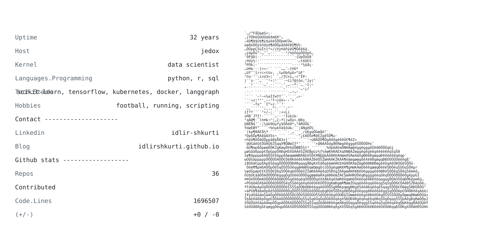

# Idlir Shkurti

Data scientist based in Germany, working across analytics, data platforms, machine learning, and production AI systems.

<picture>
  <source media="(prefers-color-scheme: dark)" srcset="./dark_mode.svg">
  
</picture>

- Data science, ML evaluation, and time-series forecasting
- DuckDB, PostgreSQL, Python, SQL, and data pipelines
- Kubernetes, Azure, FastAPI, Temporal, and LLM systems

Replace `ascii-art.txt` with your own ASCII portrait. The workflow regenerates both theme-specific cards when you push it.
